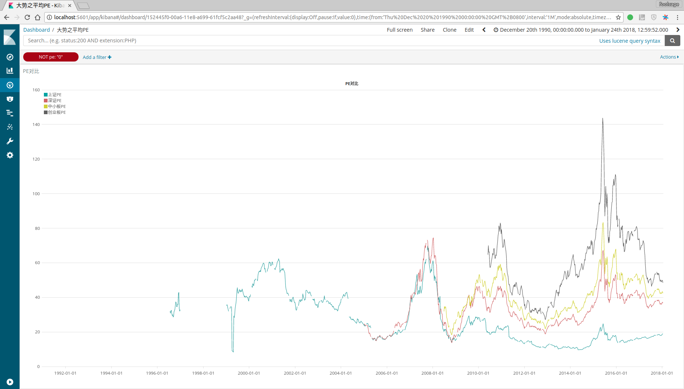

# fooltrader:trade as a fool
>"要在市场上生存，就必须远离聪明，因为，你的聪明在市场面前一钱不值"------缠中说禅  

# 使用截图

**大势dashboard**
  

**gdp市值比较**
  
>只要总市值接近GDP,基本就是顶部,而长期远离GDP也是不可能的.

**创业板PE分析**

>17.94%的时间处于20-40,50.7%时间处于40-70,26.67%的时间处于70-100,4.69%的时间处于100以上.
所以:在40左右就觉得"估值"高,看空创业板的,注定无法享受15年的创业板大牛市

**各市场PE对比**

>创业板>中小板>深证>上证?也许需要一点想象力,风格也是可以转换的?

**个股分析**

>万科的利润一直在高速增长,白菜价压了几年,所以'野蛮人'来了,还有类似的标的吗?  

**回测**

>多策略实时运行,实时监控.  

# 简介
fooltrader是一个利用*大数据*技术设计的*量化交易系统*,包括数据的抓取,清洗,结构化,计算,展示,回测和交易.  
它的目标是提供一个统一的框架来对*全市场*(股票,期货,债券,外汇,数字货币,宏观经济等)进行研究,回测,预测,交易.  
它的适用对象包括:量化交易员,财经类专业师生,对经济数据感兴趣的人,程序员,喜欢自由而有探索精神的人

# QUICK START
假设你已经clone或者fork了代码,当前目录为fooltrader
* 初始化环境
```bash
$ ./init_env.sh
```
如果你最后看到:  
Requirements installed.  
env ok  
那么恭喜你,你可以以各种姿势去玩耍了.
* 抓取数据
```bash
$ source ve/bin/activate
$ ./ve/bin/ipython
In [1]: from fooltrader.datamanager import datamanager
#抓取股票元数据
In [2]: datamanager.crawl_stock_meta()
#抓取指数数据
In [3]: datamanager.crawl_index_quote()
#抓取个股K线和tick数据
In [4]: datamanager.crawl_stock_quote(start_code=002797,end_code=002798,crawl_tick=False)
#抓取财务数据
In [5]: datamanager.crawl_finance_data(start_code=002797,end_code=002798)
```
这里把抓取数据作为一个单独的模块,而不是像tushare那样api和爬虫耦合在一起,主要是为了:
> 爬虫只干爬虫的事:专注抓取的速度,更好的数据分类,数据补全,防屏蔽等  
> api设计只依赖[*数据协议*](./docs/contract.md),从而具有更好的速度和灵活性

你也可以直接下载打包好的历史数据[*data.zip*](晚上上传到百度云盘).  
抓取每天的增量数据只需要:
```bash
$ ./sched_finance.sh
```
```bash
$ ./sched_quote.sh
```
该脚本会定时去抓取"缺少"的数据,在历史数据完整性检查通过后,其实就是只是抓取当天的数据,这样我们就有了一个自动化自我维护的完整数据源.  
可在sched_quote.py文件中进行对定时任务进行配置:  
```python
#每天17:00运行
@sched.scheduled_job('cron', hour=17, minute=00)
def scheduled_job1():
    crawl_stock_quote('000001', '002999')
    crawl_index_quote()


@sched.scheduled_job('cron', hour=17, minute=20)
def scheduled_job2():
    crawl_stock_quote('300000', '300999')


@sched.scheduled_job('cron', hour=17, minute=40)
def scheduled_job3():
    crawl_stock_quote('600000', '666666')
```

最后强调一下,数据抓下来了,怎么使用?请参考[*数据协议*](./docs/contract.md)  

* 数据存储到elastic-search
(文档待完善)

* 使用kibana进行分析
(文档待完善)

* 回测
(文档待完善)

* 交易
(文档待完善)

# 支持的功能
* 爬虫代理框架  

>可配置代理服务器池和并发数,从而提高爬虫的健壮性

* 数据抓取  
  * A股标的信息抓取  
  * A股tick数据抓取  
  * A股日线数据抓取  
  * A股财务数据抓取  
  * A股事件抓取  

>数据的处理方式是,先定义[*数据协议*](./docs/contract.md),再寻找数据源,这样做的好处是:数据协议的稳定为整个系统的稳定打下坚实的基础,多数据源比较提高数据准确性,多数据源聚合提高数据完整性.

* 常用技术指标计算(ma,ema,macd等)

>我们不需要那么多技术指标,但一定要知道所使用指标的内涵,所以,我们选择自己计算;没错,由于数据的统一性,理所当然地,计算的统一性也有了.
不管是A股,港股,还是数字货币,不管是1分钟级别,还是日线,使用的都是统一的api.

* 回测框架

>小金属涨疯了,但相关的上市公司股价还在历史新低,我是不是可以买一点?  
金叉买,死叉卖,在不同级别上表现如何?在不同标的上表现如何?  
相同的策略,如何快速的在所有标的上回测,并进行对比?  
利润增长,股价也增长?或者提前反映?滞后反映?各种表现的比例如何?  
各个策略之间如何通信,从而形成合力?  
#### 没错:回测框架必须要考虑这些问题  

# 环境准备
* 系统  
操作系统:Ubuntu 16.04.3 LTS(原则上,其他也可以,系统使用的组件都是跨平台的)  
内存:>16G  
硬盘:越大越好  

* 组件安装  
  * python
  如果你是使用ubuntu的话,原则上执行以下命令,python环境就好了:  
  ```bash
  $ git clone https://github.com/foolcage/fooltrader.git
  $ cd fooltrader
  $ ./init_env.sh
  ```
  * elastic-search and kibana(6.1.1)  
  可以参考官方文档进行安装:https://www.elastic.co/guide/en/elastic-stack/current/installing-elastic-stack.html  
  也可以用以下命令来完成:  
  ```bash
  $ #下载xpack
  $ wget https://artifacts.elastic.co/downloads/packs/x-pack/x-pack-6.1.1.zip
  $ #下载es
  $ wget https://artifacts.elastic.co/downloads/elasticsearch/elasticsearch-6.1.1.zip
  $ unzip elasticsearch-6.1.1.zip
  $ cd elasticsearch-6.1.1/
  $ #为es安装xpcck插件,就是刚刚下载的那个x-pack-6.1.1.zip,格式为file://+其路径
  $ bin/elasticsearch-plugin install file:///path/to/file/x-pack-6.1.1.zip
  $ #用fooltrader中的elasticsearch.yml覆盖es默认配置
  $ cp ../fooltrader/config/elasticsearch.yml config/
  $ #启动es,可根据自己的情况更改heap大小,<=32g
  $ ES_JAVA_OPTS="-Xms8g -Xmx8g"  ./bin/elasticsearch
  $
  $ #下载kibana
  $ wget https://artifacts.elastic.co/downloads/kibana/kibana-6.1.1-linux-x86_64.tar.gz
  $ tar -xzf kibana-6.1.1-linux-x86_64.tar.gz
  $ cd kibana-6.1.1-linux-x86_64/
  $ #为kibana安装xpcck插件,就是刚刚下载的那个x-pack-6.1.1.zip,格式为file://+其路径
  $ bin/kibana-plugin install file:///path/to/file/x-pack-6.1.1.zip
  $ #用fooltrader中的kibana.yml覆盖kibana默认配置
  $ cp ../fooltrader/config/kibana.yml config/
  $ ./bin/kibana
  ```

# TODO
* 常用API封装
* 集成vnpy的交易接口
* 期货数据抓取
* 港股数据抓取
* 美股数据抓取
* 交易DSL设计
* WEB管理界面

# 联系方式
QQ群:300911873
