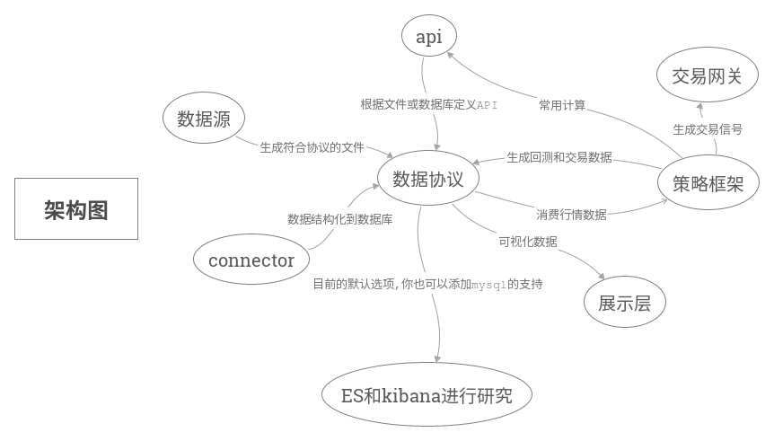

[](https://travis-ci.org/foolcage/fooltrader)

**Read this in other languages: [English](README-en.md).**  
# fooltrader:trade as a fool
>"要在市场上生存，就必须远离聪明，因为，你的聪明在市场面前一钱不值"------缠中说禅  

# 1. 使用截图
## 1.1 **A股基本面分析**  

>输入你感兴趣的个股,查看其净利润跟股价的关系,也许你就不会认为"基本表面"没用了?  
比如:万科的利润一直在高速增长,白菜价压了几年,所以'野蛮人'来了,还有类似的标的吗?  
而把全市场的个股进行计算,并自动通知你,其实也不是什么难事.

## 1.2 **美股基本面分析**  

>看一下美股的表现如何呢?  

## 1.3 **回测**  

策略的编写,可以采用事件驱动或者时间漫步的方式,查看[*设计文档*](./docs/trader.md)  

```python
class EventTrader(Trader):
    def on_init(self):
        self.trader_id = 'aa'
        self.only_event_mode = True
        self.universe = ['stock_sz_000338']
        self.df_map = {}

    def on_day_bar(self, bar_item):
        current_security = bar_item['securityId']
        current_df = self.df_map.get(current_security, pd.DataFrame())
        if current_df.empty:
            self.df_map[current_security] = current_df

        current_df = current_df.append(bar_item, ignore_index=True)
        self.df_map[current_security] = current_df

        if len(current_df.index) == 10:
            ma5 = np.mean(current_df.loc[5:, 'close'])
            ma10 = np.mean(current_df.loc[:, 'close'])
            # 5日线在10日线上,并且没有持仓,就买入
            if ma5 > ma10 and not self.account_service.get_position(current_security):
                self.buy(security_id=current_security, current_price=bar_item['close'])
            # 5日线在10日线下,并且有持仓,就卖出
            elif ma5 < ma10 and self.account_service.get_position(current_security):
                self.sell(security_id=current_security, current_price=bar_item['close'])
            current_df = current_df.loc[1:, ]
            self.df_map[current_security] = current_df
```

运行策略可以实时查看效果,并做进一步的评估


## 1.4 **大势dashboard**
  

## 1.5 **gdp市值比较**
  
>只要总市值接近GDP,基本就是顶部,而长期远离GDP也是不可能的.

## 1.6 **创业板PE分析**

>17.94%的时间处于20-40,50.7%时间处于40-70,26.67%的时间处于70-100,4.69%的时间处于100以上.
所以:在40左右就觉得"估值"高,看空创业板的,注定无法享受15年的创业板大牛市

## 1.7 **各市场PE对比**  

>创业板>中小板>深证>标普>上证?也许需要一点想象力,风格也是可以转换的?
嗯,标普的平均PE曾经也超过120,比我们的大创业板的疯狂还是差一点,然后,现在我们上证的PE其实是比标普低的,所以?

# 2. 简介
fooltrader是一个利用*大数据*技术设计的*量化交易系统*,包括数据的抓取,清洗,结构化,计算,展示,回测和交易.  
它的目标是提供一个统一的框架来对*全市场*(股票,期货,债券,外汇,数字货币,宏观经济等)进行研究,回测,预测,交易.  
它的适用对象包括:***量化交易员,财经类专业师生,对经济数据感兴趣的人,程序员,喜欢自由而有探索精神的人***

# 3. 架构图
fooltrader是一个层次清晰的系统,你可以在不同的层次对其进行使用,也可以扩展,改造或替换里面的模块.  



# 4. 使用step by step
使用的层次跟架构图里面的模块是一一对应的, 你可以在任何step停下来,进行扩展或者对接你自己熟悉的系统.  
当然,还是希望你全部跑通,因为这里的每个模块的技术选型都是经过精心考虑的,并且后续会不停完善.  

### 4.1 环境准备  
操作系统:Ubuntu 16.04.3 LTS  
原则上,其他也可以,系统使用的组件都是跨平台的,但我只在ubuntu和mac运行过    
内存:>16G  
硬盘:越大越好  
clone或者fork代码  
```bash
$ git clone https://github.com/foolcage/fooltrader.git
```
### 4.2 初始化python环境
```bash
$ cd fooltrader
$ ./init_env.sh
```
如果你最后看到:  
```bash
Requirements installed.  
env ok
```
那么恭喜你,你可以以各种姿势去玩耍了.
### 4.3 抓取数据
建议先下载打包好的历史数据[*data.zip*](https://pan.baidu.com/s/1dmZaPo).  
看一下[*数据协议*](./docs/contract.md),设置好FOOLTRADER_STORE_PATH,解压下载的文件到该目录.  
该项目的一个目的之一是方便大家共享数据,不需要每个人都去抓历史数据而导致被屏蔽.  
```bash
$ source ve/bin/activate
$ ./ve/bin/ipython
In [1]: from fooltrader.datamanager import datamanager
#抓取股票元数据
In [2]: datamanager.crawl_stock_meta()
#抓取指数数据
In [3]: datamanager.crawl_index_quote()
#抓取个股K线和tick数据
In [4]: datamanager.crawl_stock_quote(start_code=002797,end_code=002798,crawl_tick=False)
#抓取财务数据
In [5]: datamanager.crawl_finance_data(start_code=002797,end_code=002798)
```
这里把抓取数据作为一个单独的模块,而不是像tushare那样api和爬虫耦合在一起,主要是为了:
> 爬虫只干爬虫的事:专注抓取的速度,更好的数据分类,数据补全,防屏蔽等  
> api设计只依赖[*数据协议*](./docs/contract.md),从而具有更好的速度和灵活性


抓取每天的增量数据只需要:
```bash
$ ./sched_finance.sh
```
```bash
$ ./sched_quote.sh
```
该脚本会定时去抓取"缺少"的数据,在历史数据完整性检查通过后,其实就是只是抓取当天的数据,这样我们就有了一个自动化自我维护的完整数据源.  
可在sched_quote.py文件中进行对定时任务进行配置:  
```python
#每天17:00运行
@sched.scheduled_job('cron', hour=17, minute=00)
def scheduled_job1():
    crawl_stock_quote('000001', '002999')
    crawl_index_quote()


@sched.scheduled_job('cron', hour=17, minute=20)
def scheduled_job2():
    crawl_stock_quote('300000', '300999')


@sched.scheduled_job('cron', hour=17, minute=40)
def scheduled_job3():
    crawl_stock_quote('600000', '666666')
```

最后强调一下,数据抓下来了,怎么使用?请参考[*数据协议*](./docs/contract.md)  
到这里,如果你不想使用elastic-search,也不想使用python,你就是想用java,mysql,或者你superset,redash,hadoop啥的玩得很熟,没问题,根据数据协议你应该很容易的把数据放到你需要的地方进行研究.
当然,我更希望你把代码贡献到connector里面,pr给我,既提高自己的代码水平,又方便了需要使用的人,岂不快哉?  
### 4.4 elastic-search和kibana安装(6.1.1)  
>仅仅只是把数据换一个存储,系统就发生了不可思议的变化.

可以参考官方文档进行安装:https://www.elastic.co/guide/en/elastic-stack/current/installing-elastic-stack.html  
也可以用以下命令来完成:  
```bash
$ #下载xpack
$ wget https://artifacts.elastic.co/downloads/packs/x-pack/x-pack-6.1.1.zip
$ #下载es
$ wget https://artifacts.elastic.co/downloads/elasticsearch/elasticsearch-6.1.1.zip
$ unzip elasticsearch-6.1.1.zip
$ cd elasticsearch-6.1.1/
$ #为es安装xpcck插件,就是刚刚下载的那个x-pack-6.1.1.zip,格式为file://+其路径
$ bin/elasticsearch-plugin install file:///path/to/file/x-pack-6.1.1.zip
$ #用fooltrader中的elasticsearch.yml覆盖es默认配置
$ cp ../fooltrader/config/elasticsearch.yml config/
$ #启动es,可根据自己的情况更改heap大小,<=32g
$ ES_JAVA_OPTS="-Xms8g -Xmx8g"  ./bin/elasticsearch
$
$ #下载kibana
$ wget https://artifacts.elastic.co/downloads/kibana/kibana-6.1.1-linux-x86_64.tar.gz
$ tar -xzf kibana-6.1.1-linux-x86_64.tar.gz
$ cd kibana-6.1.1-linux-x86_64/
$ #为kibana安装xpcck插件,就是刚刚下载的那个x-pack-6.1.1.zip,格式为file://+其路径
$ bin/kibana-plugin install file:///path/to/file/x-pack-6.1.1.zip
$ #用fooltrader中的kibana.yml覆盖kibana默认配置
$ cp ../fooltrader/config/kibana.yml config/
$ ./bin/kibana
```

### 4.5 数据存储到elastic-search  
到这里,我还是默认你在fooltrader的ipython环境下.
```bash
In [1]: from fooltrader.connector import es_connector
#股票元信息->es
In [2]: es_connector.stock_meta_to_es()
#指数数据->es
In [3]: es_connector.index_kdata_to_es()
#个股k线->es
In [4]: es_connector.stock_kdata_to_es()
#你也可以多开几个窗口,指定范围,提高索引速度
In [4]: es_connector.stock_kdata_to_es(start='002000',end='002999')
#财务数据->es
In [5]: es_connector.balance_sheet_to_es()
In [5]: es_connector.income_statement_to_es()
In [5]: es_connector.cash_flow_statement_to_es()
```

然后,我们简单的来领略一下它的威力  
查询2017年中报净利润top 5
```bash
curl -XPOST 'localhost:9200/income_statement/doc/_search?pretty&filter_path=hits.hits._source' -H 'Content-Type: application/json' -d'
{
  "query": {
    "range": {
      "reportDate": {
        "gte": "20170630",
        "lte": "20170630"
      }
    }
  },
  "size": 5,
  "sort": [
    {
      "netProfit": {
        "order": "desc"
      }
    }
  ]
}
'
{
  "hits": {
    "hits": [
      {
        "_source": {
          "exchangeGains": 1.3242E10,
          "netProfit": 1.827E9,
          "securityId": "stock_sh_601318",
          "investmentIncome": 2.0523E10,
          "operatingProfit": 7.8107E10,
          "accumulatedOtherComprehensiveIncome": 2.0E8,
          "attributableToMinorityShareholders": 6.5548E10,
          "sellingExpenses": 1.0777E10,
          "investmentIncomeFromRelatedEnterpriseAndJointlyOperating": "398259000000.00",
          "id": "stock_sh_601318_20170630",
          "minorityInterestIncome": 6.238E10,
          "code": "601318",
          "otherComprehensiveIncome": 6.5506E10,
          "nonOperatingIncome": 4.006E9,
          "financingExpenses": 0.0,
          "reportEventDate": "2017-08-18",
          "netProfitAttributedToParentCompanyOwner": 5.778E10,
          "disposalLossOnNonCurrentLiability": 9.01E8,
          "incomeFromChangesInFairValue": -2.56E8,
          "incomeTaxExpense": 2.2E7,
          "operatingTotalCosts": 3.4139E11,
          "assetsDevaluation": 8.75E8,
          "EPS": 1.9449E10,
          "operatingCosts": 9.4E7,
          "attributableToOwnersOfParentCompany": 1.58E8,
          "ManagingCosts": 6.402E10,
          "totalProfits": 8.403E9,
          "dilutedEPS": 2.4575E10,
          "reportDate": "20170630",
          "businessTaxesAndSurcharges": 9.442E9,
          "operatingRevenue": 4.63765E11,
          "nonOperatingExpenditure": 1.35892E11
        }
      ]
    }
  }
}
```
实际上REST接口天然就有了,做跨平台接口非常方便,根据[*数据协议*](./docs/contract.md) 和ES DSL可以非常方便的进行查询和聚合计算.

### 4.6 使用kibana进行分析
(文档待完善)

### 4.7 回测
(文档待完善)

### 4.8 交易
(文档待完善)

# 支持的功能
* 爬虫代理框架  

>可配置代理服务器池和并发数,从而提高爬虫的健壮性

* 数据抓取  
  * A股标的信息抓取  
  * A股tick数据抓取  
  * A股日线数据抓取  
  * A股财务数据抓取  
  * A股事件抓取  

>数据的处理方式是,先定义[*数据协议*](./docs/contract.md),再寻找数据源,这样做的好处是:数据协议的稳定为整个系统的稳定打下坚实的基础,多数据源比较提高数据准确性,多数据源聚合提高数据完整性.

* 常用技术指标计算(ma,ema,macd等)

>我们不需要那么多技术指标,但一定要知道所使用指标的内涵,所以,我们选择自己计算;没错,由于数据的统一性,理所当然地,计算的统一性也有了.
不管是A股,港股,还是数字货币,不管是1分钟级别,还是日线,使用的都是统一的api.

* 回测框架

>小金属涨疯了,但相关的上市公司股价还在历史新低,我是不是可以买一点?  
金叉买,死叉卖,在不同级别上表现如何?在不同标的上表现如何?  
相同的策略,如何快速的在所有标的上回测,并进行对比?  
利润增长,股价也增长?或者提前反映?滞后反映?各种表现的比例如何?  
各个策略之间如何通信,从而形成合力?  
#### 没错:回测框架必须要考虑这些问题  

# TODO
* 交易DSL设计
* WEB管理界面,向导式生成策略
* 实时行情及kafka实时计算
* 集成vnpy的交易接口
* 期货数据抓取
* 港股数据抓取

# 联系方式  
QQ群:300911873  
如果你喜欢该项目,请加星支持一下,并在申请入群时告知github user name.  
